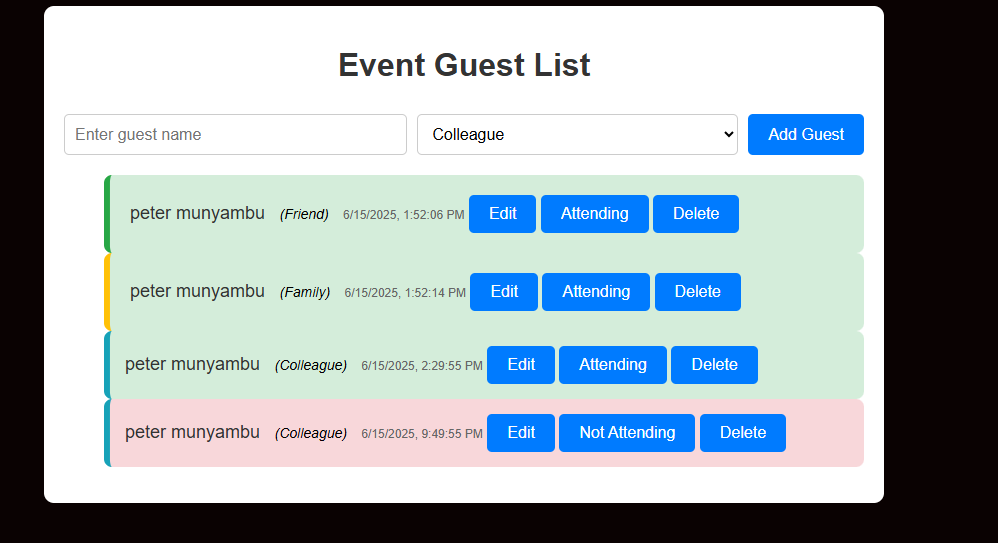

# Week2-Code-challenge

## 🎉 Event Guest List Manager

This is a simple web application that allows users to manage an event guest list. It enables adding, editing, and removing guests, categorizing them, and toggling their RSVP status. Each guest is displayed with visual tags and timestamps for clarity.

### 🚀 Features

- Add a guest with name and category (Friend, Family, Colleague)
- Guests are color-coded based on category
- Timestamp shows when the guest was added
- Toggle RSVP status (Attending / Not Attending)
- Edit guest names after adding
- Remove guests from the list
- Limit guest list to a maximum of 10 entries

### 🛠 Technologies Used

- HTML – Markup for the form and list
- CSS – Styling and category color tags
- JavaScript (ES6) – Handles all interactivity and DOM manipulation

### 📁 Project Structure

├── index.html
├── style.css
└── src/
└── index.js

### 📸 Preview

<!-- screenshot  -->

### 🧪 How to Use

1. Clone this repository or download the files.
2. Open `index.html` in your browser.
3. Start adding guests and interact with the list!

### 📌 Notes

- Each category has a different colored border:
  - 🟢 Friend: Green
  - 🟡 Family: Yellow
  - 🔵 Colleague: Blue
- RSVP status changes the background color:
  - very pale Green for attending
  - very plae Red for not attending

### Author

Created by peter munyambu

### license

PNM license, Feel free to contribute or suggest improvements!
